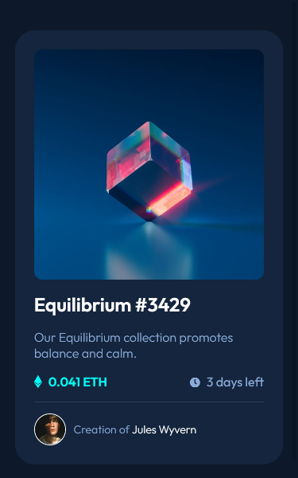
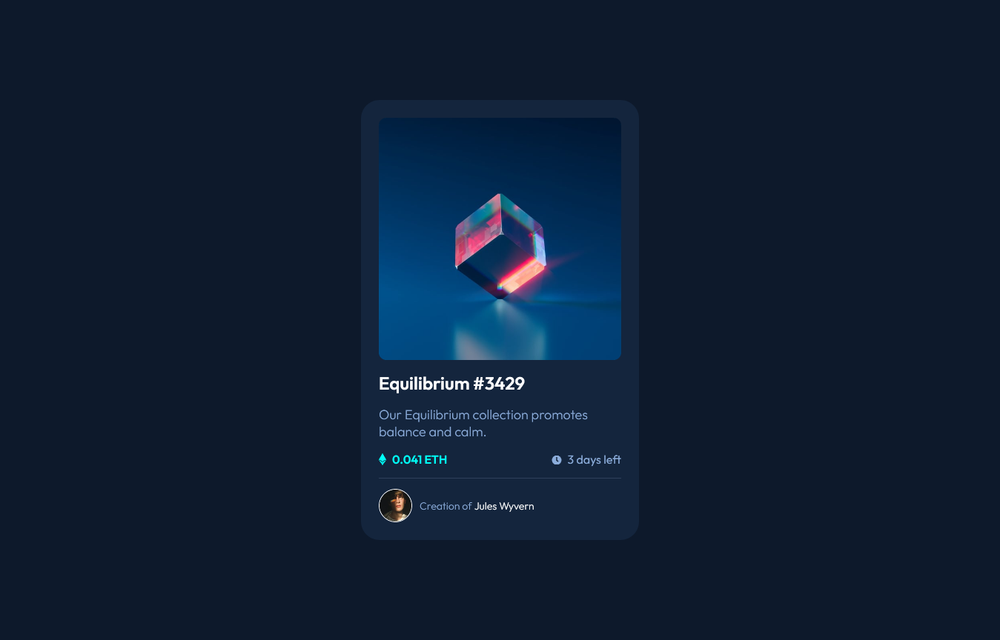

# Frontend Mentor - NFT preview card component solution

This is a solution to the [NFT preview card component challenge on Frontend Mentor](https://www.frontendmentor.io/challenges/nft-preview-card-component-SbdUL_w0U). Frontend Mentor challenges help you improve your coding skills by building realistic projects. 

## Table of contents

- [Overview](#overview)
  - [The challenge](#the-challenge)
  - [Screenshot](#screenshot)
  - [Links](#links)
- [My process](#my-process)
  - [Built with](#built-with)
- [Author](#author)

**Note: Delete this note and update the table of contents based on what sections you keep.**

## Overview

### The challenge

Users should be able to:

- View the optimal layout depending on their device's screen size
- See hover states for interactive elements

### Screenshot

### Mobile Solution (375px width)

### Desktop Solution (1366px width)

### Links

-  [Solution URL](https://github.com/AchrefFast/Frontend-Mentor--NFT-preview-card-componen)
- [Live Site URL](https://achreffast.github.io/Frontend-Mentor--NFT-preview-card-componen/)

## My process

### Built with

- Semantic HTML5 markup
- SASS Variables
-  Mobile-first workflow
- CSS Grid
- CSS Flex

## Author

- Frontend Mentor - [@AchrefFast](https://www.frontendmentor.io/profile/AchrefFast)
